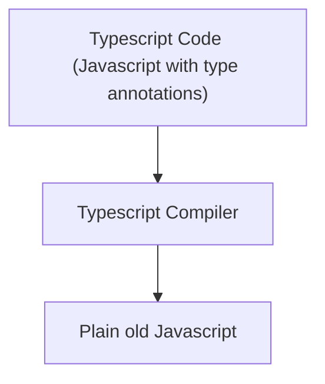

## TypeScript

### TypeScript = JavaScript + Type System

-   TS Type System
    -   Helps us catch errors during development
    -   Uses `type annotations` to analyze our code
    -   Only active during development
    -   Doesn't provide any performance optimization

<br>



-   Browser executes plain Javascript, has no idea we wrote Typescript

<br>

### ts-node

-   It's going to automatically compile a given file and then automatically execute the resulting JavaScript

```sh
$ ts-node index.ts
```

<br>
<br>

## Types

-   Easy way to refer to the different properties + functions that a value has
-   Every value that we create has a type assigned to it
-   Every value in TypeScript has a type

### Primitive Types

-   number
-   string
-   boolean
-   symbol
-   void
-   null
-   undefined

### Object Types

-   functions
-   classes
-   arrays
-   objects

### Why do we care about types?

-   Types are used by the TypeScript Compiler to analyze our code for errors
-   Types allow other engineers to understand what values are flowing around our codebase
