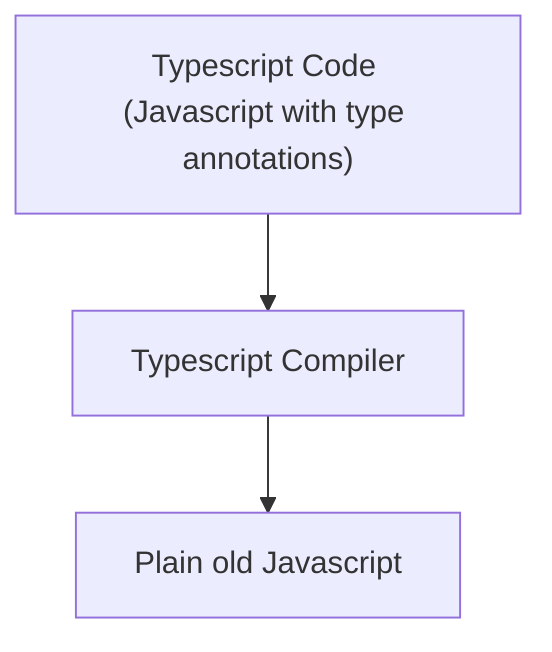

## TypeScript

### TypeScript = JavaScript + Type System

-   TS Type System
    -   Helps us catch errors during development
    -   Uses `type annotations` to analyze our code
    -   Only active during development
    -   Doesn't provide any performance optimization

<br>



-   Browser executes plain Javascript, has no idea we wrote Typescript

<br>

### ts-node

-   It's going to automatically compile a given file and then automatically execute the resulting JavaScript

```sh
$ npm install -g typescript ts-node
$ ts-node index.ts
```

<br>
