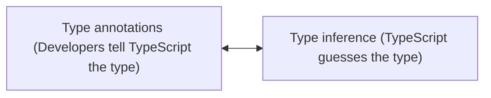

## Types

-   Easy way to refer to the different properties + functions that a value has
-   Every value that we create has a type assigned to it
-   Every value in TypeScript has a type

### Primitive Types

-   number
-   string
-   boolean
-   symbol
-   void
-   null
-   undefined

### Object Types

-   functions
-   classes
-   arrays
-   objects

### Why do we care about types?

-   Types are used by the TypeScript Compiler to analyze our code for errors
-   Types allow other engineers to understand what values are flowing around our codebase

 
 

## Type annotations vs Type inference

### Type annotations

-   Code we add to tell TypeScript what type of value a variable will refer to
-   When to use,,,
    -   When we declare a variable on one line then initialize it later
    -   When we want a variable to have a type that can't be inferred
    -   When a function returns the 'any' type and we need to clarify the value

### Type inference

-   TypeScript tries to figure out what type of value a variable refers to
-   TypeScript is going to attempt to `automatically figure out` what type of value a variable refers to
-   `If declaration and initialization are on the same line`, TypeScript will use type inference for us
-   When to use,,,
    -   Always!

 

<image src="../public/type-annotations.png" width="800px" />

 
 

### any

-   A type, just as 'string' or 'boolean' are
-   Means TS has no idea what this is - can't check for correct property references
-   Avoid variables with 'any' at all costs
