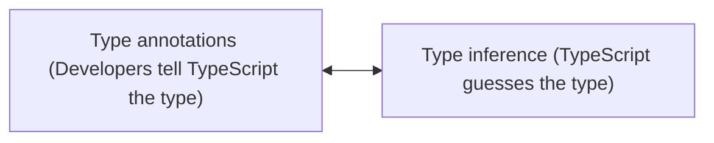

## Types

-   Easy way to refer to the different properties + functions that a value has
-   Every value that we create has a type assigned to it
-   Every value in TypeScript has a type

### Primitive Types

-   number
-   string
-   boolean
-   symbol
-   void
-   null
-   undefined

### Object Types

-   functions
-   classes
-   arrays
-   objects

### Why do we care about types?

-   Types are used by the TypeScript Compiler to analyze our code for errors
-   Types allow other engineers to understand what values are flowing around our codebase

 
 

## Type annotations vs Type inference

### Type annotations

-   Code we add to tell TypeScript what type of value a variable will refer to
-   When to use,,,
    -   When we declare a variable on one line then initialize it later
    -   When we want a variable to have a type that can't be inferred
    -   When a function returns the 'any' type and we need to clarify the value

### Type inference

-   TypeScript tries to figure out what type of value a variable refers to
-   TypeScript is going to attempt to `automatically figure out` what type of value a variable refers to
-   `If declaration and initialization are on the same line`, TypeScript will use type inference for us
-   When to use,,,
    -   Always!

 

<image src="../public/type-annotations.png" width="800px" />

 

### any

-   A type, just as 'string' or 'boolean' are
-   Means TS has no idea what this is - can't check for correct property references
-   Avoid variables with 'any' at all costs

 
 

## Functions

### Type annotations for functions

-   Code we add to telll TypeScript what type of arguments a function will receive and whay type of values it will return

### Type inference for functions

-   TypeScript tries to figure out what type of value a function will return

 
 

## Arrays

### Typed Arrays

-   Arrays where each element is some consistent type of value

### Why do we care?

-   TS can do type inference when extracting values from an array
-   TS can prevent us from adding incompatible values to the array
-   We can get help with `map`, `forEach`, `reduce` functions
-   Flexible - arrays can still contain multiple different types

### Where to use typed arrays?

-   Any time we need to represent a collection of records with some arbitrary sort order

 
 

## Tuples

### Tuple

-   Array-like structure where each element represents some property of a record
-   We have what looks like an array and we put in our property values into that array in a very specific order

 
 

## Interfaces

### Interface

-   Creates a new type, describing the property names and value types of an object

### General Strategy for Reusable Code in TS

-   Create functions that accept arguments that are typed with interfaces
-   Objects/Classes can decide to `implement` a given interface to work with a function

 

<image src="../public/interface.png" width="800px" />

 
 

## Classes

### Class

-   Blueprint to create an object with some fields (values) and methods (functions) to represent a 'thing'

### Classes in TypeScript

-   existence of something called `modifiers`
-   Modifiers are a keyword so we can `place on different methods and properties inside of a class`
-   The goal of these different modifiers is to `restrict access to different functions or different variables`

 

<image src="../public/modifiers.png" width="800px" />

 

-   **_public_**
    -   By default, every different method and property that we add to a class is always going to have the public modifier on it
-   **_private_**
    -   The only reason to mark something as private is to restrict the different methods that other developers can call
        -   If we have some method that we just don't want other developers to call, we will mark it as being private
-   **_protected_**
    -   Just like private
    -   The only difference is that with protected we can access the given method in child classes as well
